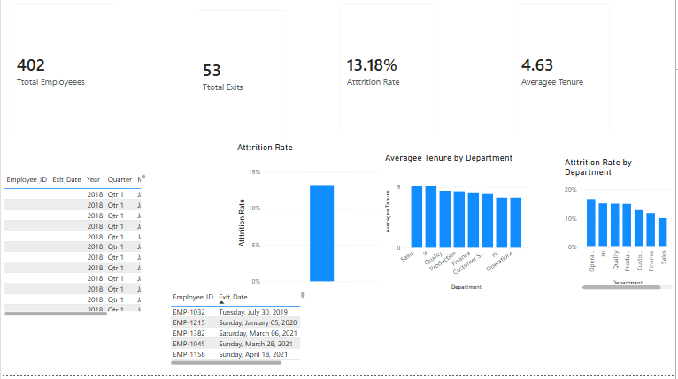

# HR Analytics – Power BI

## Project Overview
An HR Analytics dashboard built using Microsoft Power BI.

## Tools Used
- Power BI
- DAX
- Power Query
- Data Modeling

## Dashboard
The dashboard provides insights into:
- Total Employees
- Total Exits
- Attrition Rate
- Average Tenure
- Employees by Department
- Employees by Hire Year
- Department-level HR insights

## Objective
The goal of this project is to analyze HR data and provide clear insights that can support HR decision-making.
## Dashboard Preview

